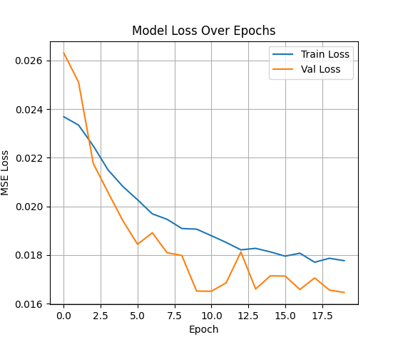

# 🧠 Self-Driving Car Project – CVI620 Final Project

This project focuses on building an end-to-end deep learning model to predict steering angles from road images using the **Udacity Self-Driving Car Simulator**.

---

## 🚗 Overview

We developed a Convolutional Neural Network (CNN) model to drive a simulated vehicle using visual input. The model was trained on data collected manually by driving in the simulator and predicts the appropriate steering angle for the car based on the road ahead.

---

## 📂 Project Structure

```bash
CVI-Project/
│
├── preprocess.py         # Image loading, cropping, color space conversion, normalization
├── augment.py            # Random flipping and brightness adjustment
├── train.py              # Model architecture, compilation, training and saving
├── self_driving_model.keras  # Final trained model
├── driving_log.csv       # Collected driving data (steering angles and image paths)
└── TestSimulation.py     # Flask-based testing script for real-time prediction
```

---

## 🔧 Approach

### 🧼 1. Data Preprocessing
- Loaded center camera images
- Cropped out sky and car hood
- Converted to **YUV** color space (as in Nvidia’s model)
- Applied **Gaussian blur** and resized to `200x66`
- Normalized pixel values to `[0, 1]`

### 🎨 2. Data Augmentation
- Random **horizontal flipping** with inverted steering angle
- Random **brightness adjustment** using `cv2.multiply`
- Keras **ImageDataGenerator**: random zoom, pan, shear, rotation

### 🧠 3. Model Architecture (Based on Nvidia)
- Normalization layer
- 5 Convolutional layers (with strides for downsampling)
- 3 Fully connected layers
- Final output: single neuron for steering angle

### 🧪 4. Training
- Optimizer: `Adam`, LR = 0.0001
- Loss: Mean Squared Error (MSE)
- Batch Size: 64
- Epochs: 20
- Real-time data feeding with augmented generator

### 🎮 5. Inference & Testing
- Flask + SocketIO server receives simulator images
- Processes them in real-time and predicts steering angle
- Sends control back to simulator

---

## ❗ Challenges Faced

| Challenge | Solution |
|----------|----------|
| Simulator crashed after clicking 'Play' | Updated GPU drivers and reinstalled Unity-based simulator |
| Flask server not receiving data | Downgraded to compatible versions:<br> `python-socketio==4.2.1`, `flask-socketio==3.3.1`, `python-engineio==3.8.2` |
| Model driving too far right | Improved with augmentation and re-training |
| Val_loss remained constant | Resolved by reducing LR, adding strides, and improving data diversity |

---

## 🧪 Final Performance

- ✅ Smooth driving across the entire track
- 📉 Final validation loss: ~0.016


---

## ▶️ How to Run

1. **Setup Environment**
   ```bash
   pip install -r requirements.txt
   ```

2. **Collect Data**
   - Open simulator → Training Mode
   - Drive forward and reverse multiple times
   - Save images and `driving_log.csv`

3. **Preprocess & Augment**
   ```bash
   python preprocess.py
   python augment.py
   ```

4. **Train Model**
   ```bash
   python train.py
   ```

5. **Run Inference**
   - Open simulator in **Autonomous Mode**
   - Run:
     ```bash
     python TestSimulation.py
     ```

---

## 🧠 Requirements

```txt
tensorflow==2.19.0
keras
opencv-python
numpy
pandas
matplotlib
flask
eventlet
python-socketio==4.2.1
flask-socketio==3.3.1
python-engineio==3.8.2
```

## 📸 Demo Video

🎥 [This is a link to the video of the simulator running successfully](https://youtu.be/Go95WpndmPU)
